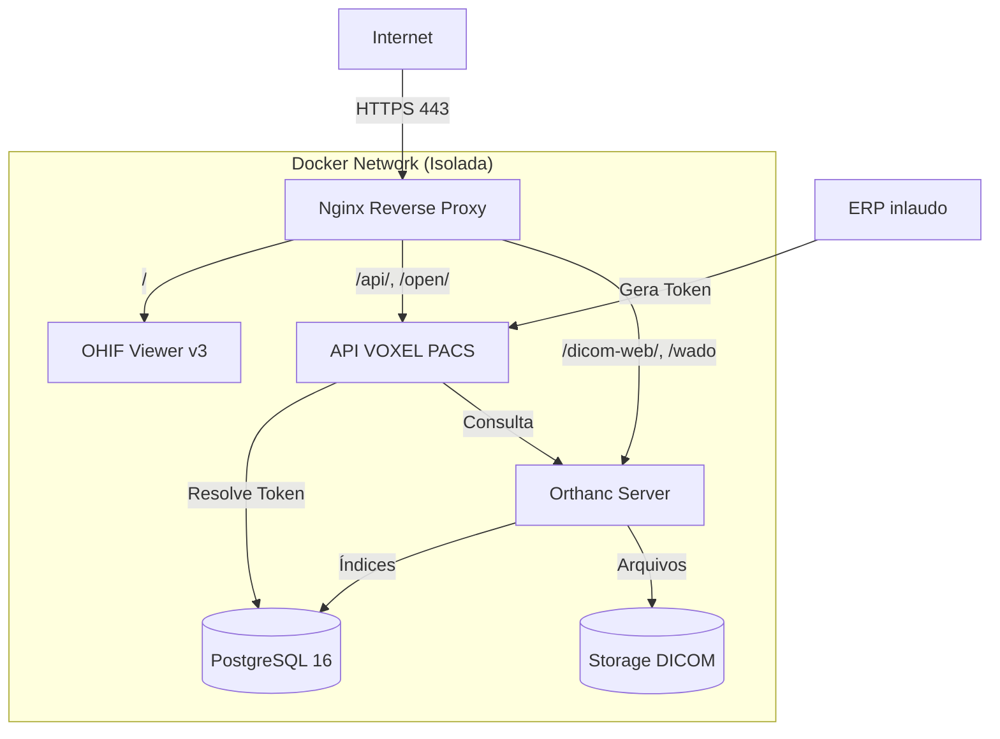

# Arquitetura VOXEL PACS v1.0

Este documento descreve a arquitetura da plataforma VOXEL PACS v1.0, projetada para ser modular, escalável e segura.

## Visão Geral

A mudança estratégica da versão 1.0 é que **o Orthanc deixa de ser "o sistema" e passa a ser apenas o repositório DICOM**. Toda a inteligência de negócios (autenticação, tokens, auditoria, integrações) foi movida para a **API VOXEL PACS**.



## Componentes

### 1. Nginx (Host)
- Único ponto de entrada da Internet.
- Gerencia SSL (Let's Encrypt).
- Roteia o tráfego para os containers corretos.
- Nenhuma porta Docker é exposta diretamente.

### 2. API VOXEL PACS
- O coração do sistema.
- **Responsabilidades:** Autenticação, RBAC, geração de tokens, auditoria, integração com RIS/ERP/HL7.
- **Fluxo de exame:** O ERP gera um token → A API valida → Retorna o StudyUID → Redireciona o OHIF. O usuário final nunca vê o StudyUID real na URL original.

### 3. PostgreSQL 16
- Substitui o SQLite.
- Armazena os dados da API VOXEL PACS e os **índices/metadados** do Orthanc.
- Não armazena arquivos DICOM.

### 4. Orthanc
- Atua exclusivamente como servidor DICOM (C-STORE) e provedor DICOMweb (QIDO-RS, WADO-RS).
- Configuração modular: dividida em arquivos menores (`orthanc.json`, `dicomweb.json`, `postgresql.json`, etc.) para facilitar a manutenção.

### 5. Storage DICOM
- Volume mapeado no host (`/opt/voxelpacs/storage/dicom`).
- Armazena apenas os arquivos DICOM brutos.
- Separado do banco de dados para facilitar snapshots, backups incrementais e futura migração para S3/MinIO.

### 6. OHIF Viewer v3
- Container independente (nunca embutido no Orthanc).
- Acessa o Orthanc exclusivamente via DICOMweb (através do proxy Nginx).
- Versão fixa configurada via `dataSources` para evitar quebras por atualizações não planejadas.

## Estrutura de Diretórios

Toda a infraestrutura fica contida em um único diretório base (ex: `/opt/voxelpacs`), facilitando o versionamento e backup:

```
/opt/voxelpacs/
├── api/                  # Configurações da API
├── backups/              # Backups gerados pelos scripts
├── config/               # Templates originais (legado)
├── docker/               # docker-compose.yml
├── docs/                 # Documentação
├── logs/                 # Logs do sistema
├── nginx/                # Configurações do Nginx
├── ohif/                 # app-config.js e logo
├── orthanc/              # Configurações modulares (JSON)
├── postgres/             # Volume do banco de dados
├── scripts/              # Scripts de automação (install, backup, etc)
└── storage/
    └── dicom/            # Volume dos arquivos DICOM
```

## Estratégia de Backup

O backup foi redesenhado para não ser um arquivo monolítico gigante. Ele é dividido em três partes:

1. **Banco de Dados:** `pg_dump` do PostgreSQL (rápido, pequeno, essencial).
2. **Storage DICOM:** `tar.gz` dos arquivos (grande, pode ser feito incrementalmente).
3. **Configs:** `tar.gz` dos arquivos de configuração e scripts (pequeno, essencial para disaster recovery).

## Monitoramento

O sistema expõe endpoints de healthcheck para monitoramento externo:
- `/health` — Status do Nginx.
- `/live` — Liveness probe.
- `/ready` — Readiness probe (API verifica conexão com banco e Orthanc).
